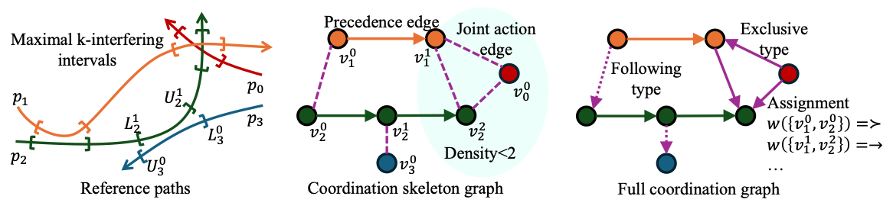
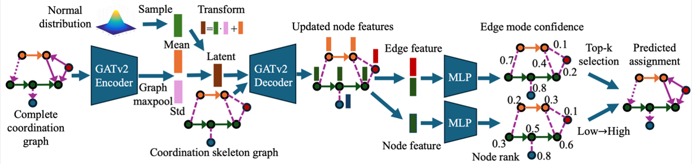
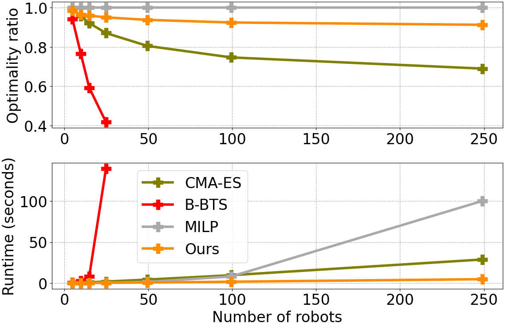

# Reliable and Efficient Multi-Agent Coordination via Graph Neural Network Variational Autoencoders

[Project page](https://mengyuest.github.io/gnn-vae-coord/)

[<ins>Yue Meng</ins>1](https://mengyuest.github.io/), [<ins>Nathalie Majcherczyk</ins>2](https://scholar.google.com/citations?hl=en&user=gQMpFlIAAAAJ&view_op=list_works&sortby=pubdate), [<ins>Wenliang Liu</ins>2](https://scholar.google.com/citations?user=bO40W5UAAAAJ&hl=en), [<ins>Scott Kiesel</ins>2](https://scholar.google.com/citations?hl=en&user=hRyYQAIAAAAJ&view_op=list_works&sortby=pubdate), [<ins>Chuchu Fan</ins>1](https://chuchu.mit.edu/), [<ins>Federico Pecora</ins>2](https://www.amazon.science/author/federico-pecora)

[1<ins>Reliable Autonomous Systems Lab @ MIT (REALM)</ins>](https://aeroastro.mit.edu/realm/) 

[2<ins>Amazon Robotics</ins>](https://amazon.jobs/content/en/teams/ftr/amazon-robotics)

> Official implementation for ICRA2025 paper, "Reliable and Efficient Multi-Agent Coordination via Graph Neural Network Variational Autoencoders." [\[link\]](https://ieeexplore.ieee.org/stamp/stamp.jsp?tp=&arnumber=10638176)

> The work was done when Yue was an Applied Science Intern at Amazon Robotics.

## Formulation

Coordination graph formualation

GNN-VAE framework for Multi-agent coordination

## Experimental results

<b>Ours</b> can generate close-to-oracle (<b>MILP</b>) assignments with the optimality ratio consistently over 0.9 while the optimality ratio curves for <b>B-BTS</b> and <b>CMA-ES</b> drop quickly as the number of robots is more than 20. This shows the great generalizability of our approach. <b>Ours</b> can be 10 to 20 times faster than the baselines, solving coordination problem with 250 robots in less than 5 seconds on average.

## Requirements and Demos
Coming soon.